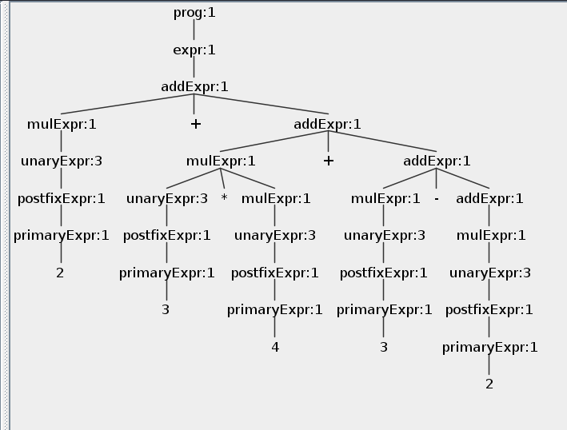

# Asociatividad y Precedencia

Adaptamos una nueva gramatica para probar la asociatividad y precedencia.


```bash
grammar LabeledExpr;

prog: expr+ ;

expr
    : addExpr
    ;

addExpr
    : mulExpr ( (ADD | SUB) mulExpr )*
    ;

mulExpr
    : powExpr ( (MUL | DIV | MOD) powExpr )*
    ;

powExpr
    : unaryExpr ( POW unaryExpr )*
    ;

unaryExpr
    : SUB unaryExpr     # unaryMinus
    | ADD unaryExpr     # unaryPlus
    | postfixExpr       # toPostfix
    ;


postfixExpr
    : primaryExpr (FACT)*            # factf
    ;

primaryExpr
    : INT                           # int
    | DOUBLE                        # double
    | ID                            # id
    | '(' expr ')'                  # parens
    | RAD ID '(' expr ')'           # funcRad
    | ID '(' expr ')'               # funcCall
    | SQRT '(' expr ')'             # sqrtf
    | LN '(' expr ')'               # lnf
    | LOG '(' expr ')'              # logf
    ;

MUL : '*' ;
DIV : '/' ;
MOD : '%' ;
POW : '^' ;
ADD : '+' ;
SUB : '-' ;
DOUBLE : [0-9]+ '.' [0-9]+ ;
INT : [0-9]+ ;
RAD : 'rad' ;
SQRT : 'sqrt' ;
LN : 'ln' ;
LOG : 'log' ;
FACT : '!' ;
ID  : [a-zA-Z]+ ;
NEWLINE:'\r'? '\n' ;
WS  : [ \t]+ -> skip ;


```


La gramática esta organizada en capas:

expr → addexpr → mulexpr → powexpr → unaryexpr → postfix → primary
---
Para la suma, resta, multiplicacion, division, modulo y factorial definimos:
* Asociatividad Por izquierda
Para la potenciacion, asumimos asociatividad por derecha, por el siguiente ejemplo:

2 ^ 3 ^ 2
→ 2 ^ (3 ^ 2)
---
# Ejemplo 1 Asociativa por izquierda precedencia normal

Si ingresamos una entrada de 2+3*4. Obtenemos el siguiente analisis:


* Operador de precedencia: Como la multiplicacion tiene mayor precedencia en nuestras reglas, se realiza primero la operacion de 3*4
* Luego se realiza la operacion 2+(3*4)
Obtenemos el siguiente resultado:


Esto es con asociatividad a la izquierda.
# Cambiando el orden de precedencia

```bash
mulExpr
    : addExpr ( (MUL | DIV | MOD) addExpr )*  # mulLeft
    ;

addExpr
    : unaryExpr ( (ADD | SUB) unaryExpr )*    # addLeft
    ;
```
Como existe asociativa por izquierda, para cambiar el orden de precedencia simplemente cambiamos la asociacion para la regla de term y de expr, de esta manera term primero la suma llama a unaryEXpr y luego la multiplicacion llama a addExpr

Como modificamos el orden, tambien debemos modificar el eval visitor

Para el input 2+3*4:


# Ejemplo 2 Asociativa por derecha y precedencia normal

```bash
grammar LabeledExpr;

prog: expr+;

expr
    : addExpr        # toAdd
    ;

addExpr
    : mulExpr ( (ADD | SUB) addExpr )?    # addRight
    ;

mulExpr
    : unaryExpr ( (MUL | DIV | MOD) mulExpr )?  # mulRight
    ;

unaryExpr
    : SUB unaryExpr     # unaryMinus
    | ADD unaryExpr     # unaryPlus
    | postfixExpr       # toPostfix
    ;

postfixExpr
    : primaryExpr (FACT)*  # factf
    ;

primaryExpr
    : INT                 # int
    | DOUBLE              # double
    | ID                  # id
    | '(' expr ')'        # parens
    | RAD ID '(' expr ')' # funcRad
    | ID '(' expr ')'     # funcCall
    | SQRT '(' expr ')'   # sqrtf
    | LN '(' expr ')'     # lnf
    | LOG '(' expr ')'    # logf
    ;

MUL : '*' ;
DIV : '/' ;
MOD : '%' ;
POW : '^' ;
ADD : '+' ;
SUB : '-' ;
DOUBLE : [0-9]+ '.' [0-9]+ ;
INT : [0-9]+ ;
RAD : 'rad' ;
SQRT : 'sqrt' ;
LN : 'ln' ;
LOG : 'log' ;
FACT : '!' ;
ID  : [a-zA-Z]+ ;
NEWLINE:'\r'? '\n' ;
WS  : [ \t]+ -> skip ;

```
Ejemplo con 10-5-2


Ejemplo con 2+3*4+3-2




# Ejemplo 2 Asociativa por derecha y precedencia invertida
```bash
grammar LabeledExpr;

prog: expr+;

expr
    : addExpr       # toAdd
    ;

addExpr
    : mulExpr( (ADD | SUB) addExpr )?    # addRight
    ;

mulExpr
    : unaryExpr ( (MUL | DIV | MOD) mulExpr)?  # mulRight
    ;

unaryExpr
    : SUB unaryExpr     # unaryMinus
    | ADD unaryExpr     # unaryPlus
    | postfixExpr       # toPostfix
    ;

postfixExpr
    : primaryExpr (FACT)*  # factf
    ;

primaryExpr
    : INT                 # int
    | DOUBLE              # double
    | ID                  # id
    | '(' expr ')'        # parens
    | RAD ID '(' expr ')' # funcRad
    | ID '(' expr ')'     # funcCall
    | SQRT '(' expr ')'   # sqrtf
    | LN '(' expr ')'     # lnf
    | LOG '(' expr ')'    # logf
    ;

MUL : '*' ;
DIV : '/' ;
MOD : '%' ;
POW : '^' ;
ADD : '+' ;
SUB : '-' ;
DOUBLE : [0-9]+ '.' [0-9]+ ;
INT : [0-9]+ ;
RAD : 'rad' ;
SQRT : 'sqrt' ;
LN : 'ln' ;
LOG : 'log' ;
FACT : '!' ;
ID  : [a-zA-Z]+ ;
NEWLINE:'\r'? '\n' ;
WS  : [ \t]+ -> skip ;

```
Caso para 10-5-2


Caso 2+3*4

